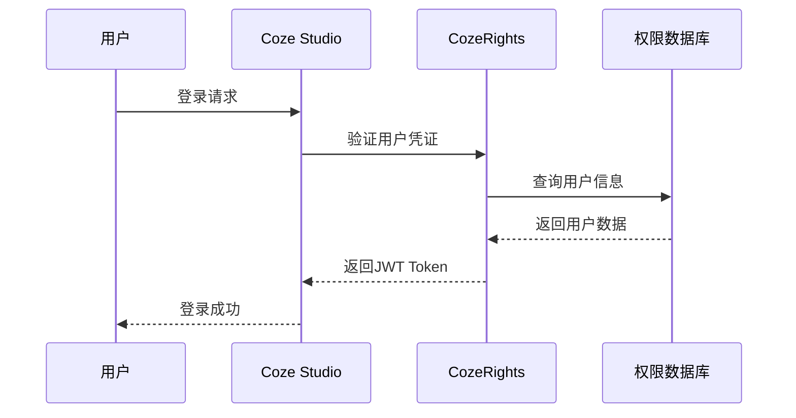
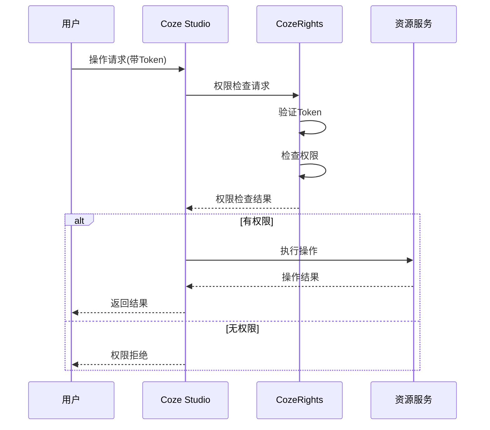

# Coze Studio 权限集成分析报告

## 1. Coze平台核心组件权限需求分析

### 1.1 Agent管理权限
- **创建Agent**: 需要工作空间创建权限
- **编辑Agent**: 需要Agent所有者权限或工作空间管理权限
- **发布Agent**: 需要发布权限，可能涉及不同发布渠道
- **删除Agent**: 需要Agent所有者权限或工作空间管理权限
- **调用Agent API**: 需要API访问权限和使用配额

### 1.2 Workflow工作流权限
- **创建Workflow**: 需要工作空间创建权限
- **编辑Workflow**: 需要Workflow所有者权限
- **执行Workflow**: 需要执行权限和资源配额
- **发布Workflow**: 需要发布权限
- **查看执行日志**: 需要监控权限

### 1.3 Plugin插件权限
- **安装Plugin**: 需要工作空间插件管理权限
- **配置Plugin**: 需要插件配置权限
- **使用Plugin**: 需要插件使用权限和API配额
- **开发Plugin**: 需要开发者权限

### 1.4 Knowledge知识库权限
- **创建知识库**: 需要工作空间创建权限
- **上传文档**: 需要知识库编辑权限
- **查询知识库**: 需要知识库访问权限
- **管理向量数据**: 需要知识库管理权限

### 1.5 Model模型权限
- **配置模型**: 需要系统管理员权限
- **使用模型**: 需要模型使用权限和Token配额
- **监控模型使用**: 需要监控权限

### 1.6 API访问权限
- **Personal Access Token**: 需要Token管理权限
- **API调用**: 需要相应的资源访问权限
- **SDK集成**: 需要集成权限

## 2. 权限集成点设计

### 2.1 API层集成点
```
Coze API请求 → CozeRights权限验证 → 业务逻辑处理
```

**集成方式**：
1. **中间件拦截**: 在Coze的API中间件中集成权限验证
2. **统一网关**: 通过API网关统一处理权限验证
3. **SDK封装**: 在Coze SDK中集成权限检查

### 2.2 业务层集成点
```
业务操作 → 权限检查 → 资源访问控制 → 使用量统计
```

**集成方式**：
1. **服务调用**: 在业务逻辑中调用CozeRights API
2. **事件驱动**: 通过事件总线进行权限状态同步
3. **数据库集成**: 共享权限数据库或数据同步

### 2.3 前端集成点
```
用户操作 → 前端权限检查 → API调用 → 后端权限验证
```

**集成方式**：
1. **权限组件**: 开发React权限控制组件
2. **路由守卫**: 在前端路由中集成权限检查
3. **UI状态管理**: 根据权限动态显示/隐藏功能

## 3. 统一权限验证流程

### 3.1 认证流程


### 3.2 授权流程


## 4. 权限模型映射

### 4.1 Coze资源到CozeRights权限映射

| Coze资源 | CozeRights权限 | 权限级别 |
|---------|---------------|---------|
| Agent | agent:create, agent:read, agent:update, agent:delete | 工作空间级 |
| Workflow | workflow:create, workflow:read, workflow:update, workflow:delete, workflow:execute | 工作空间级 |
| Plugin | plugin:install, plugin:configure, plugin:use | 工作空间级 |
| Knowledge | knowledge:create, knowledge:read, knowledge:update, knowledge:delete | 工作空间级 |
| Model | model:configure, model:use | 租户级 |
| API | api:access, api:manage | 用户级 |

### 4.2 角色权限预设

#### 工作空间所有者 (workspace_owner)
- 所有工作空间资源的完全权限
- 成员管理权限
- 配额管理权限

#### 工作空间管理员 (workspace_admin)
- Agent、Workflow、Plugin、Knowledge的管理权限
- 成员邀请权限
- 使用统计查看权限

#### 开发者 (developer)
- Agent、Workflow的创建和编辑权限
- Plugin的使用权限
- Knowledge的创建和查询权限

#### 使用者 (user)
- Agent的使用权限
- Workflow的执行权限
- Knowledge的查询权限

## 5. API集成规范

### 5.1 权限检查API
```http
POST /api/v1/permissions/check
Authorization: Bearer {token}
Content-Type: application/json

{
  "resource": "agent",
  "action": "create",
  "workspace_id": "123",
  "resource_id": "456"
}
```

### 5.2 批量权限检查API
```http
POST /api/v1/permissions/batch-check
Authorization: Bearer {token}
Content-Type: application/json

{
  "checks": [
    {
      "resource": "agent",
      "action": "read",
      "workspace_id": "123",
      "resource_id": "456"
    },
    {
      "resource": "workflow",
      "action": "execute",
      "workspace_id": "123",
      "resource_id": "789"
    }
  ]
}
```

### 5.3 使用量统计API
```http
POST /api/v1/usage/record
Authorization: Bearer {token}
Content-Type: application/json

{
  "resource": "model",
  "action": "api_call",
  "workspace_id": "123",
  "resource_id": "gpt-4",
  "quantity": 1000,
  "unit": "tokens",
  "metadata": {
    "model_name": "gpt-4",
    "input_tokens": 500,
    "output_tokens": 500
  }
}
```

## 6. 集成实施计划

### 阶段1: 基础集成 (1-2周)
- [ ] 在Coze API中间件中集成权限验证
- [ ] 实现基本的RBAC权限检查
- [ ] 完成用户认证集成

### 阶段2: 深度集成 (2-3周)
- [ ] 实现资源级权限控制
- [ ] 集成使用量统计
- [ ] 完成前端权限组件开发

### 阶段3: 高级功能 (2-3周)
- [ ] 实现动态权限策略
- [ ] 完成计费系统集成
- [ ] 实现权限审计和监控

### 阶段4: 优化和测试 (1-2周)
- [ ] 性能优化
- [ ] 安全测试
- [ ] 集成测试和文档完善
