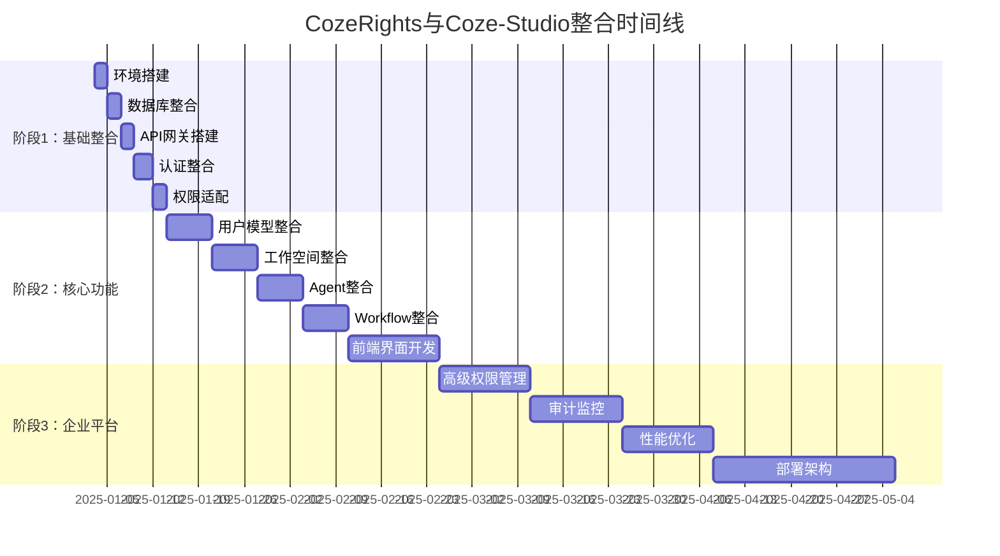

# CozeRights 与 Coze-Studio 分步实施计划

## 🎯 实施概述

本文档提供了CozeRights与Coze-Studio整合的详细分步实施计划，包含每个步骤的具体技术实现方案、时间节点、资源需求、风险评估和测试验证策略。

## 📅 实施时间线



## 🚀 第一阶段：基础整合 (1-2周)

### 步骤1：开发环境整合 (2天)

#### 技术实现方案

**1.1 代码仓库重构**
```bash
# 创建新的统一仓库结构
mkdir coze-enterprise
cd coze-enterprise

# 初始化Git仓库
git init
git submodule add https://github.com/your-org/cozerights.git backend/cozerights
git submodule add https://github.com/coze-dev/coze-studio.git backend/coze-studio

# 创建统一的项目结构
mkdir -p {backend/gateway,frontend/enterprise-ui,scripts,docs,configs}
```

**1.2 Docker容器化配置**
```yaml
# docker-compose.yml
version: '3.8'
services:
  # CozeRights服务
  cozerights:
    build: 
      context: ./backend/cozerights
      dockerfile: Dockerfile
    ports:
      - "8080:8080"
    environment:
      - DB_HOST=postgres
      - DB_PORT=5432
      - DB_NAME=coze_enterprise
      - REDIS_HOST=redis
    depends_on:
      - postgres
      - redis
    networks:
      - coze-network

  # Coze-Studio服务
  coze-studio:
    build:
      context: ./backend/coze-studio
      dockerfile: Dockerfile
    ports:
      - "8081:8081"
    environment:
      - DB_HOST=postgres
      - DB_PORT=5432
      - DB_NAME=coze_enterprise
    depends_on:
      - postgres
    networks:
      - coze-network

  # API网关
  api-gateway:
    build:
      context: ./backend/gateway
      dockerfile: Dockerfile
    ports:
      - "80:80"
      - "443:443"
    environment:
      - COZERIGHTS_URL=http://cozerights:8080
      - COZE_STUDIO_URL=http://coze-studio:8081
    depends_on:
      - cozerights
      - coze-studio
    networks:
      - coze-network

  # 数据库
  postgres:
    image: postgres:14
    environment:
      POSTGRES_DB: coze_enterprise
      POSTGRES_USER: postgres
      POSTGRES_PASSWORD: password
    volumes:
      - postgres_data:/var/lib/postgresql/data
      - ./scripts/init-db.sql:/docker-entrypoint-initdb.d/init-db.sql
    networks:
      - coze-network

  # Redis缓存
  redis:
    image: redis:7-alpine
    networks:
      - coze-network

volumes:
  postgres_data:

networks:
  coze-network:
    driver: bridge
```

**1.3 统一配置管理**
```go
// configs/config.go
package config

import (
    "gopkg.in/yaml.v2"
    "io/ioutil"
)

type Config struct {
    Server    ServerConfig    `yaml:"server"`
    Database  DatabaseConfig  `yaml:"database"`
    Redis     RedisConfig     `yaml:"redis"`
    Services  ServicesConfig  `yaml:"services"`
    Security  SecurityConfig  `yaml:"security"`
}

type ServerConfig struct {
    Port         int    `yaml:"port"`
    Host         string `yaml:"host"`
    ReadTimeout  int    `yaml:"read_timeout"`
    WriteTimeout int    `yaml:"write_timeout"`
}

type ServicesConfig struct {
    CozeRights CozeRightsConfig `yaml:"cozerights"`
    CozeStudio CozeStudioConfig `yaml:"coze_studio"`
}

type CozeRightsConfig struct {
    URL     string `yaml:"url"`
    Timeout int    `yaml:"timeout"`
}

type CozeStudioConfig struct {
    URL     string `yaml:"url"`
    Timeout int    `yaml:"timeout"`
}

func LoadConfig(path string) (*Config, error) {
    data, err := ioutil.ReadFile(path)
    if err != nil {
        return nil, err
    }
    
    var config Config
    err = yaml.Unmarshal(data, &config)
    return &config, err
}
```

#### 时间节点
- **Day 1 上午**：代码仓库重构
- **Day 1 下午**：Docker配置编写
- **Day 2 上午**：配置管理实现
- **Day 2 下午**：环境测试和验证

#### 资源需求
- **人力**：1名DevOps工程师 + 1名后端工程师
- **硬件**：开发服务器（8核16G内存）
- **软件**：Docker、Git、IDE

#### 风险评估
- **低风险**：Docker配置问题 → 解决方案：充分测试
- **中风险**：代码冲突 → 解决方案：仔细的合并策略

#### 测试验证策略
```bash
# 验证脚本
#!/bin/bash
echo "开始环境验证..."

# 1. 检查Docker服务
docker-compose up -d
sleep 30

# 2. 检查服务健康状态
curl -f http://localhost:8080/health || exit 1
curl -f http://localhost:8081/health || exit 1
curl -f http://localhost/health || exit 1

# 3. 检查数据库连接
docker-compose exec postgres psql -U postgres -d coze_enterprise -c "SELECT 1;"

echo "环境验证完成！"
```

### 步骤2：数据库整合设计 (2天)

#### 技术实现方案

**2.1 数据库架构设计**
```sql
-- scripts/init-db.sql
-- 创建数据库架构

-- CozeRights架构 (保持不变)
CREATE SCHEMA IF NOT EXISTS cozerights;

-- Coze-Studio架构 (增强版)
CREATE SCHEMA IF NOT EXISTS coze_studio;

-- 共享架构
CREATE SCHEMA IF NOT EXISTS shared;

-- ID映射表
CREATE TABLE shared.id_mappings (
    id SERIAL PRIMARY KEY,
    source_system VARCHAR(50) NOT NULL,
    source_id VARCHAR(100) NOT NULL,
    target_system VARCHAR(50) NOT NULL,
    target_id VARCHAR(100) NOT NULL,
    resource_type VARCHAR(50) NOT NULL,
    metadata JSONB,
    created_at TIMESTAMP DEFAULT NOW(),
    updated_at TIMESTAMP DEFAULT NOW(),
    UNIQUE(source_system, source_id, target_system, resource_type)
);

-- 创建索引
CREATE INDEX idx_id_mappings_source ON shared.id_mappings(source_system, source_id);
CREATE INDEX idx_id_mappings_target ON shared.id_mappings(target_system, target_id);
CREATE INDEX idx_id_mappings_type ON shared.id_mappings(resource_type);

-- 数据同步日志表
CREATE TABLE shared.sync_logs (
    id SERIAL PRIMARY KEY,
    operation VARCHAR(20) NOT NULL, -- 'create', 'update', 'delete'
    resource_type VARCHAR(50) NOT NULL,
    resource_id VARCHAR(100) NOT NULL,
    source_system VARCHAR(50) NOT NULL,
    target_system VARCHAR(50) NOT NULL,
    status VARCHAR(20) NOT NULL, -- 'pending', 'success', 'failed'
    error_message TEXT,
    retry_count INTEGER DEFAULT 0,
    created_at TIMESTAMP DEFAULT NOW(),
    updated_at TIMESTAMP DEFAULT NOW()
);
```

**2.2 数据迁移服务**
```go
// backend/gateway/internal/migration/service.go
package migration

import (
    "context"
    "fmt"
    "gorm.io/gorm"
)

type MigrationService struct {
    sourceDB *gorm.DB // Coze-Studio数据库
    targetDB *gorm.DB // 统一数据库
    logger   Logger
}

type IDMapping struct {
    ID           uint   `gorm:"primaryKey"`
    SourceSystem string `gorm:"not null"`
    SourceID     string `gorm:"not null"`
    TargetSystem string `gorm:"not null"`
    TargetID     string `gorm:"not null"`
    ResourceType string `gorm:"not null"`
    Metadata     string `gorm:"type:jsonb"`
    CreatedAt    time.Time
    UpdatedAt    time.Time
}

func (s *MigrationService) MigrateUsers(ctx context.Context) error {
    s.logger.Info("开始迁移用户数据...")
    
    // 1. 获取Coze-Studio用户数据
    var cozeUsers []CozeStudioUser
    if err := s.sourceDB.Find(&cozeUsers).Error; err != nil {
        return fmt.Errorf("获取Coze-Studio用户失败: %w", err)
    }
    
    // 2. 创建默认租户
    defaultTenant := &Tenant{
        Name:     "Default Tenant",
        Code:     "default",
        IsActive: true,
        MaxUsers: 10000,
        MaxSpaces: 1000,
    }
    if err := s.targetDB.Create(defaultTenant).Error; err != nil {
        return fmt.Errorf("创建默认租户失败: %w", err)
    }
    
    // 3. 迁移用户数据
    for _, cozeUser := range cozeUsers {
        // 转换用户数据
        unifiedUser := &UnifiedUser{
            TenantID:       defaultTenant.ID,
            Username:       cozeUser.UserUniqueName,
            Email:          cozeUser.Email,
            UserUniqueName: cozeUser.UserUniqueName, // 兼容字段
            Avatar:         cozeUser.Avatar,
            SystemRole:     "user",
            IsActive:       true,
        }
        
        // 保存用户
        if err := s.targetDB.Create(unifiedUser).Error; err != nil {
            s.logger.Error("迁移用户失败", "user", cozeUser.UserUniqueName, "error", err)
            continue
        }
        
        // 记录ID映射
        mapping := &IDMapping{
            SourceSystem: "coze-studio",
            SourceID:     cozeUser.UserID,
            TargetSystem: "unified",
            TargetID:     fmt.Sprintf("%d", unifiedUser.ID),
            ResourceType: "user",
        }
        s.targetDB.Create(mapping)
        
        s.logger.Info("用户迁移成功", "user", cozeUser.UserUniqueName)
    }
    
    s.logger.Info("用户数据迁移完成", "count", len(cozeUsers))
    return nil
}

func (s *MigrationService) MigrateSpaces(ctx context.Context) error {
    s.logger.Info("开始迁移空间数据...")
    
    // 类似的迁移逻辑...
    return nil
}
```

#### 时间节点
- **Day 3 上午**：数据库架构设计
- **Day 3 下午**：迁移服务开发
- **Day 4 上午**：迁移脚本测试
- **Day 4 下午**：数据验证和修复

#### 资源需求
- **人力**：1名数据库工程师 + 1名后端工程师
- **硬件**：数据库服务器
- **软件**：PostgreSQL、数据迁移工具

#### 风险评估
- **高风险**：数据丢失 → 解决方案：完整备份策略
- **中风险**：数据不一致 → 解决方案：严格的验证流程

#### 测试验证策略
```go
// 数据验证测试
func TestDataMigration(t *testing.T) {
    // 1. 验证用户数据完整性
    var sourceCount, targetCount int64
    sourceDB.Model(&CozeStudioUser{}).Count(&sourceCount)
    targetDB.Model(&UnifiedUser{}).Count(&targetCount)
    assert.Equal(t, sourceCount, targetCount)
    
    // 2. 验证ID映射完整性
    var mappingCount int64
    targetDB.Model(&IDMapping{}).Where("resource_type = ?", "user").Count(&mappingCount)
    assert.Equal(t, sourceCount, mappingCount)
    
    // 3. 验证数据一致性
    // ... 更多验证逻辑
}
```

### 步骤3：API网关搭建 (2天)

#### 技术实现方案

**3.1 API网关核心实现**
```go
// backend/gateway/main.go
package main

import (
    "github.com/gin-gonic/gin"
    "github.com/coze-enterprise/gateway/internal/proxy"
    "github.com/coze-enterprise/gateway/internal/middleware"
)

func main() {
    r := gin.Default()
    
    // 中间件
    r.Use(middleware.CORS())
    r.Use(middleware.RequestID())
    r.Use(middleware.Logger())
    r.Use(middleware.Recovery())
    
    // 健康检查
    r.GET("/health", func(c *gin.Context) {
        c.JSON(200, gin.H{"status": "ok"})
    })
    
    // API路由组
    api := r.Group("/api")
    
    // CozeRights API (v1)
    v1 := api.Group("/v1")
    v1.Use(middleware.Auth())
    v1.Any("/*path", proxy.ProxyToCozeRights())
    
    // Coze-Studio兼容API
    legacy := api.Group("/legacy")
    legacy.Use(middleware.Auth())
    legacy.Any("/*path", proxy.ProxyToCozeStudio())
    
    // 统一API (v2) - 新增
    v2 := api.Group("/v2")
    v2.Use(middleware.Auth())
    v2.Use(middleware.Permission())
    v2.Any("/*path", proxy.HandleUnifiedAPI())
    
    r.Run(":80")
}
```

**3.2 代理服务实现**
```go
// backend/gateway/internal/proxy/proxy.go
package proxy

import (
    "net/http/httputil"
    "net/url"
    "github.com/gin-gonic/gin"
)

type ProxyConfig struct {
    CozeRightsURL string
    CozeStudioURL string
}

func ProxyToCozeRights() gin.HandlerFunc {
    target, _ := url.Parse(config.CozeRightsURL)
    proxy := httputil.NewSingleHostReverseProxy(target)
    
    return func(c *gin.Context) {
        // 修改请求路径
        c.Request.URL.Path = "/api/v1" + c.Param("path")
        
        // 添加请求头
        c.Request.Header.Set("X-Forwarded-For", c.ClientIP())
        c.Request.Header.Set("X-Gateway", "coze-enterprise")
        
        // 代理请求
        proxy.ServeHTTP(c.Writer, c.Request)
    }
}

func ProxyToCozeStudio() gin.HandlerFunc {
    target, _ := url.Parse(config.CozeStudioURL)
    proxy := httputil.NewSingleHostReverseProxy(target)
    
    return func(c *gin.Context) {
        // 路径转换逻辑
        c.Request.URL.Path = convertLegacyPath(c.Param("path"))
        
        // 代理请求
        proxy.ServeHTTP(c.Writer, c.Request)
    }
}

func HandleUnifiedAPI() gin.HandlerFunc {
    return func(c *gin.Context) {
        path := c.Param("path")
        
        // 根据路径决定路由到哪个服务
        if isCozeRightsPath(path) {
            ProxyToCozeRights()(c)
        } else if isCozeStudioPath(path) {
            ProxyToCozeStudio()(c)
        } else {
            c.JSON(404, gin.H{"error": "API not found"})
        }
    }
}
```

#### 时间节点
- **Day 5 上午**：网关核心开发
- **Day 5 下午**：代理服务实现
- **Day 6 上午**：中间件开发
- **Day 6 下午**：集成测试

#### 资源需求
- **人力**：1名后端工程师 + 1名DevOps工程师
- **硬件**：负载均衡器
- **软件**：Nginx、Go

#### 风险评估
- **中风险**：性能瓶颈 → 解决方案：负载测试和优化
- **低风险**：路由错误 → 解决方案：充分的单元测试

#### 测试验证策略
```go
// API网关测试
func TestAPIGateway(t *testing.T) {
    // 1. 测试路由正确性
    testCases := []struct{
        path     string
        expected string
    }{
        {"/api/v1/users", "cozerights"},
        {"/api/legacy/spaces", "coze-studio"},
        {"/api/v2/workspaces", "unified"},
    }
    
    for _, tc := range testCases {
        // 发送请求并验证路由
    }
    
    // 2. 测试认证中间件
    // 3. 测试权限中间件
    // 4. 测试错误处理
}
```

## 📊 成功标准与验收条件

### 阶段1成功标准
- [ ] **环境搭建**：Docker环境正常运行，所有服务健康
- [ ] **数据迁移**：100%数据迁移成功，无数据丢失
- [ ] **API网关**：所有API路由正确，响应时间<100ms
- [ ] **认证整合**：统一登录功能正常，Token验证有效
- [ ] **权限适配**：基础权限检查功能正常

### 验收测试清单
```bash
# 自动化验收测试脚本
#!/bin/bash

echo "开始阶段1验收测试..."

# 1. 环境健康检查
./scripts/health-check.sh

# 2. 数据迁移验证
./scripts/data-migration-test.sh

# 3. API功能测试
./scripts/api-test.sh

# 4. 认证功能测试
./scripts/auth-test.sh

# 5. 权限功能测试
./scripts/permission-test.sh

echo "阶段1验收测试完成！"
```

---

**实施计划版本**：v1.0.0  
**制定时间**：2025-01-02  
**制定者**：CozeRights开发团队
